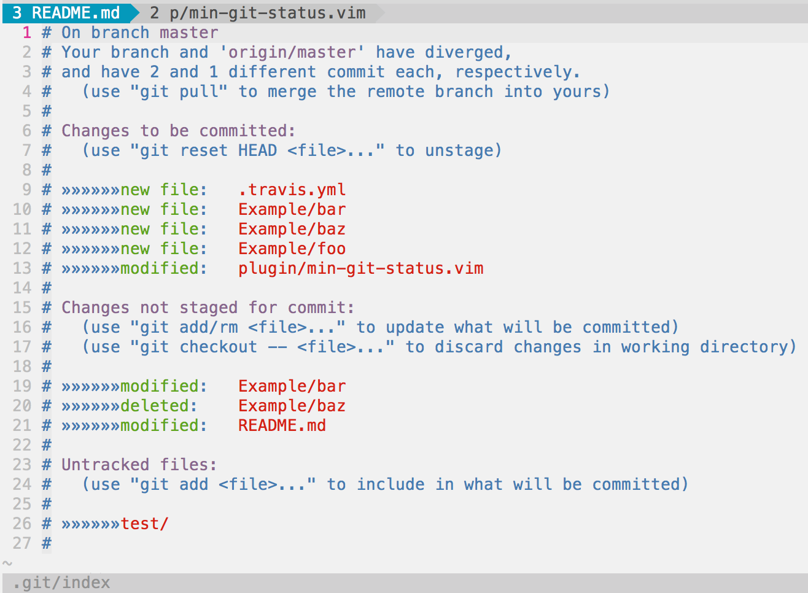
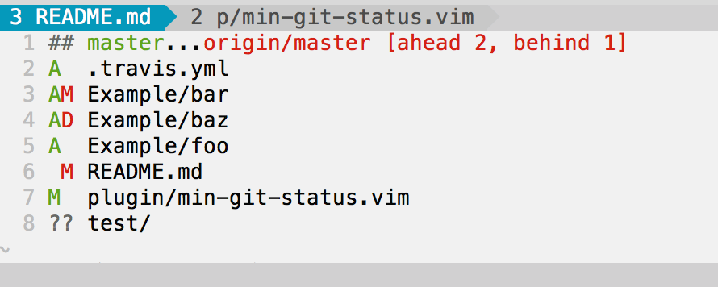

vim-min-git-status
==================

A minimal replacement for fugitive's Gstatus command. Uses `git status --short` to render status which keeps things concise and clean.

## What are the advantages over Gstatus?
* **Space conscious** (See screenshots below)
  - Same information conveyed in fewer lines
  - Status window automatically resizes to fit its content
* **More file shortcuts**
  - Press `t` on a file to open it in a new tab
  - Press `v` on a file to open it in a new vertical split
  - Press `s` on a file to open it in a new horizontal split
* **Files don't move or re-order themselves when staging / unstaging**
  - Files always remain in alphabetical order instead of being grouped by their status in the git index

## Installation
* **Installation with [Vundle](https://github.com/gmarik/Vundle.vim)**
  - Add `Bundle 'alexdavid/vim-min-git-status'` to your vimrc
  - run `vim +BundleInstall!`

* **Installation with [Pathogen](https://github.com/tpope/vim-pathogen)**
  - `git clone git://github.com/alexdavid/vim-min-git-status.git ~/.vim/bundle`

## Screenshots
| **Gstatus**                 |**Gministatus**                       |
|-----------------------------|--------------------------------------|
|  |  |
